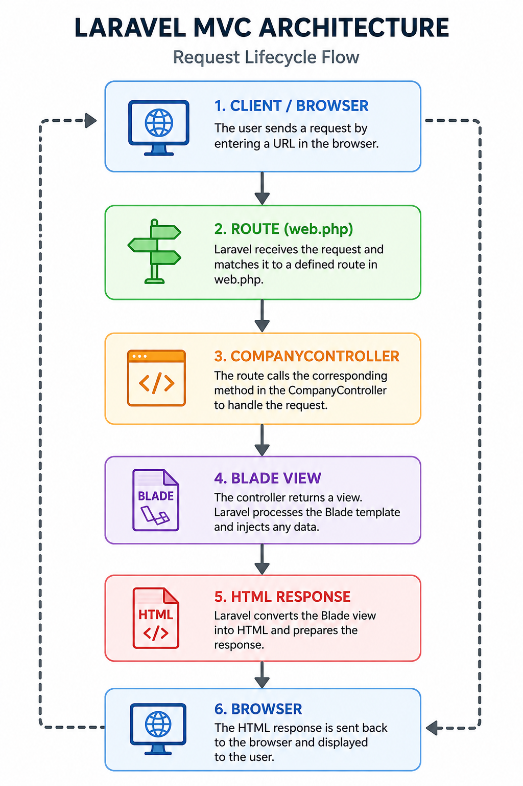
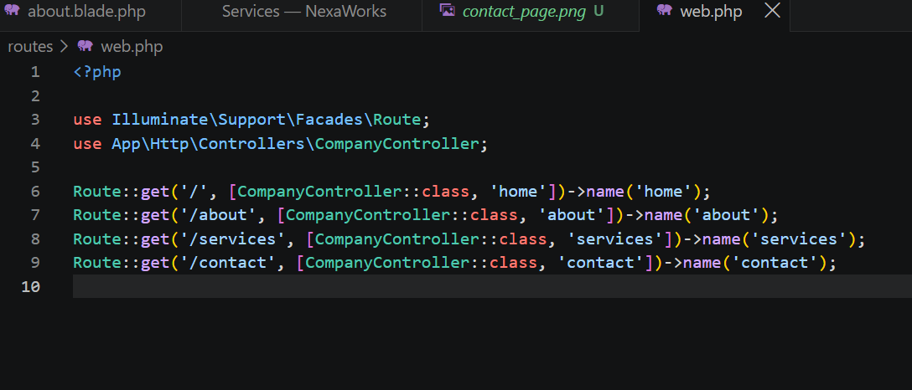
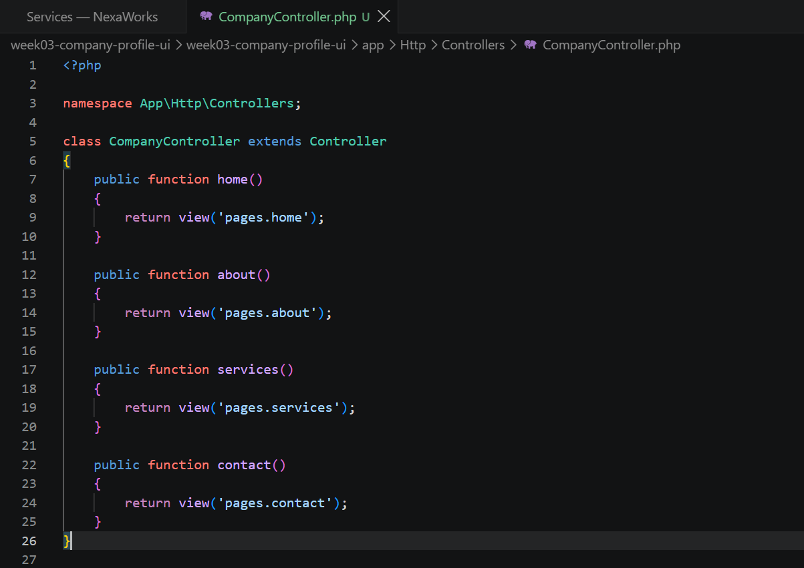
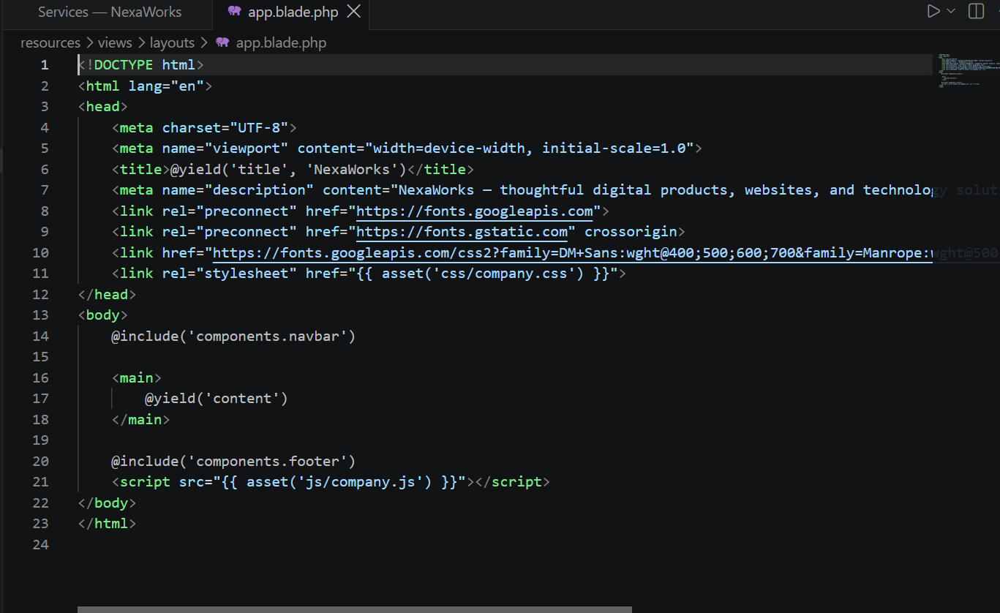
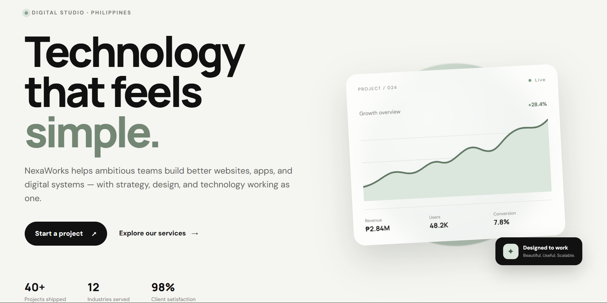
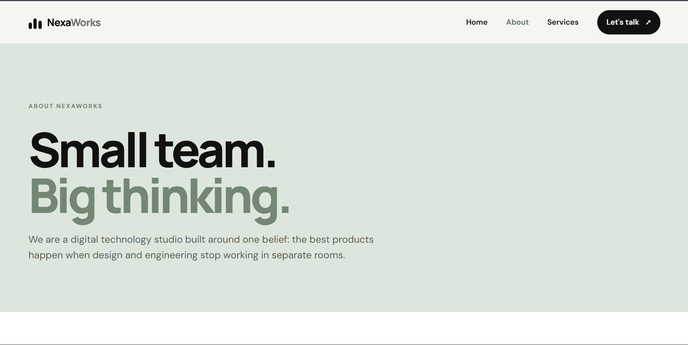
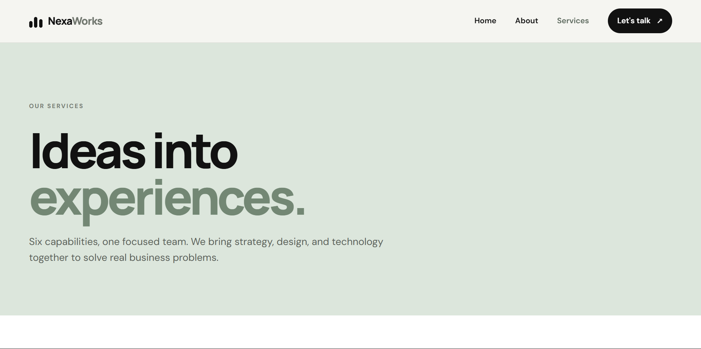
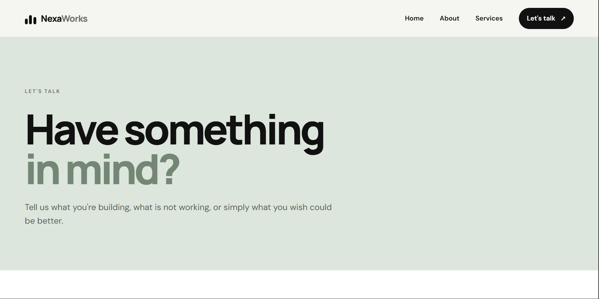
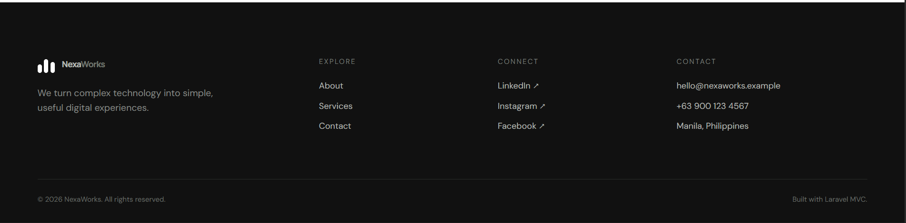

# Company Profile Website using Laravel MVC

---

## 1. Introduction

### What is a Company Profile Website?

A Company Profile Website is a website that provides information about a company, its services, background, team, and contact details. It serves as the company's online presence and allows visitors to learn about the organization and the services it provides.

### Why Businesses Need a Company Profile Website

Businesses need a company profile website to establish a professional online presence and make important information easily accessible to customers. A well-designed website helps a company introduce its services, build credibility, communicate with potential clients, and provide convenient ways for people to get in touch. Without an online presence, businesses risk losing visibility and trust in a digital-first world.

### Purpose of This Project

This project was developed as part of the Week 3 laboratory activity for ITST 302 – Client-Server Technologies. The purpose is to develop a professional multi-page company profile website using Laravel's Model-View-Controller (MVC) architecture.

The project demonstrates the use of Laravel routing, controllers, Blade templates, reusable layouts, and organized project structures. The website contains four main pages: Home, About, Services, and Contact.

---

## 2. Objectives

The main objectives accomplished in this project are:

- Create a professional multi-page company profile website using Laravel.
- Implement Laravel routes for different pages.
- Create a `CompanyController` to handle client requests.
- Use Blade templates to create dynamic web pages.
- Create a reusable Blade layout for consistent website structure.
- Create reusable navbar and footer components.
- Apply the MVC architecture in organizing the application.
- Develop a responsive and professional user interface.
- Display company information, services, team information, and contact details.
- Practice Git version control and maintain the project using a GitHub repository.

---

## 3. MVC Architecture

### What is MVC?

MVC stands for Model-View-Controller. It is a software architecture pattern that separates an application into three main components, each with a distinct responsibility.

- The **Model** represents and manages application data and interacts with the database.
- The **View** is responsible for displaying the user interface. It presents data to the user in a readable format using HTML and Blade templates.
- The **Controller** acts as the middleman between the Model and the View. It receives requests from the browser, processes them, and decides which View to return.

For this company profile project, the main logic is handled through the `CompanyController`, while the pages are built using Blade views. No database models were needed since the content is static.

### Why Laravel Uses MVC

Laravel uses MVC because it promotes clean, organized, and maintainable code. Instead of mixing routing logic, application logic, and HTML in a single file, MVC separates each concern into its own layer. This makes it easier for developers to work on one part of the application without affecting the others. It also makes the codebase easier to read, test, and scale over time.

### Advantages of MVC

Using MVC provides several advantages:

- **Separation of concerns** – Each component has a single, well-defined responsibility.
- **Better organization** – Files are grouped by their role, making the project easier to navigate.
- **Reusability** – Layouts and components can be shared across multiple pages without duplication.
- **Maintainability** – Updating one part of the application is easier without affecting unrelated parts.
- **Scalability** – The structure can support growth as new features are added.
- **Team collaboration** – Developers can work on different parts of the application independently.

### Laravel Request Flow



---

## 4. Laravel Routing

### What is Routing?

Routing is the mechanism that determines how an application responds to a specific URL and HTTP request method. In Laravel, routes are defined in routes/web.php and connect a URL path to a controller method or a closure.

When a user accesses a URL in the browser, Laravel checks the route definitions to find a matching route and then executes the associated controller method.

### GET Requests

This project uses `Route::get()` to handle GET requests. A GET request is made when a user navigates to a page in the browser. It retrieves and displays content without modifying any data.

Example:

```php
Route::get('/about', [CompanyController::class, 'about'])->name('about');
```

When the user visits `/about`, Laravel calls the `about()` method in `CompanyController`, which returns the About page view.

### Named Routes

Named routes allow a route to be referenced by a name instead of its URL. This is useful because if the URL ever changes, only the route definition needs to be updated — not every link in the application.

Example definition:

```php
Route::get('/services', [CompanyController::class, 'services'])->name('services');
```

Example usage in a Blade template:

```blade
<a href="{{ route('services') }}">Services</a>
```

### Route Definitions

```php
use App\Http\Controllers\CompanyController;

Route::get('/', [CompanyController::class, 'home'])->name('home');
Route::get('/about', [CompanyController::class, 'about'])->name('about');
Route::get('/services', [CompanyController::class, 'services'])->name('services');
Route::get('/contact', [CompanyController::class, 'contact'])->name('contact');
```

### Route Screenshot



---

## 5. Controllers

### Purpose of Controllers

A controller receives HTTP requests forwarded by the router and determines what response should be returned. It keeps application logic out of the route file and out of the views, acting as the coordinator between the two.

The controller for this project is located at:

`app/Http/Controllers/CompanyController.php`

### Benefits of Controllers

- Keeps route definitions clean and readable.
- Centralizes page logic in one organized class.
- Separates request handling from the HTML presentation layer.
- Makes it easy to add logic such as passing data to views in the future.
- Allows related methods to be grouped together in a single file.

### Controller Methods

```php
<?php

namespace App\Http\Controllers;

class CompanyController extends Controller
{
    public function home()
    {
        return view('pages.home');
    }

    public function about()
    {
        return view('pages.about');
    }

    public function services()
    {
        return view('pages.services');
    }

    public function contact()
    {
        return view('pages.contact');
    }
}
```

Each method returns a Blade view from the `resources/views/pages/` directory.

### Controller Screenshot



---

## 6. Blade Templating Engine

Blade is Laravel's built-in templating engine. It allows developers to create HTML views using Blade directives and Laravel's template syntax. Blade files use the `.blade.php` extension.

This project uses Blade to create the four main pages and reusable website layouts and components.

### Blade Layouts

A Blade layout is a reusable template that defines the common structure of multiple pages. Instead of repeating the same HTML structure on every page, this project uses one shared layout.

The main layout is located at:

`resources/views/layouts/app.blade.php`

The layout contains the common website structure, including the navigation bar, main content area, footer, CSS, and JavaScript.

### Blade Components

Blade components are reusable parts of the user interface. They help reduce code duplication by allowing common elements to be created once and reused throughout the website.

This project uses the following components:

- `resources/views/components/navbar.blade.php` — contains the navigation bar and navigation links.
- `resources/views/components/footer.blade.php` — contains the footer, copyright information, and other footer content.

### @extends

The `@extends` directive allows a Blade page to use an existing layout.

```blade
@extends('layouts.app')
```

This tells Laravel that the page should use:

 `resources/views/layouts/app.blade.php`

 The individual page then provides the content that will be inserted into the layout.

### @section

The `@section` directive defines a section of content in a child Blade view. The content is inserted into the corresponding `@yield` directive in the layout.

```blade
@section('title', 'Home — NexaWorks')

@section('content')
    <h1>Welcome</h1>
@endsection
```

### @yield

The `@yield` directive is placed inside the layout file. It marks the location where a child view's `@section` content will be inserted.

```blade
<title>@yield('title', 'NexaWorks')</title>

<main>
    @yield('content')
</main>
```

### @include

The `@include` directive inserts another Blade file into the current view. It is used in the layout to include the navbar and footer components.

```blade
@include('components.navbar')
@include('components.footer')
```

### Blade Layout Screenshot



---

## 7. Laravel Folder Structure

| Folder | Purpose |
|---|---|
| `app/` | Contains the core application code including Controllers and Models. The `CompanyController.php` is located inside `app/Http/Controllers/`. |
| `routes/` | Contains all route definition files. `web.php` defines the routes for browser-accessible pages. |
| `resources/` | Contains views, raw CSS, and JavaScript. Blade templates are stored inside `resources/views/`. |
| `public/` | The web server's document root. Contains compiled assets, `index.php` (the application entry point), `css/company.css`, and `js/company.js`. |
| `bootstrap/` | Contains the application bootstrapping files that initialize the Laravel framework on each request. |
| `config/` | Contains all configuration files for the application such as database settings, mail, cache, and session configuration. |

---

## 8. Screenshots

The following screenshots document the completed company profile website and important parts of the Laravel project.

### Home Page


### About Page


### Services Page


### Contact Page


### Navigation Bar


### Footer


### Route Definitions


### Controller


### Blade Layout


---

## 9. Problems Encountered

### Problem 1: Difficulty Deciding the UI/UX Design

One of the first challenges I encountered was deciding on the UI/UX design of the company profile website. I had to consider the layout, colors, typography, navigation, spacing, and overall appearance of the pages. It took some time to decide on a design that was professional, consistent, and suitable for a company profile website.

### Problem 2: Unexpected Duplicate File in the Project

Another problem I encountered was an unexpected duplicate project folder/file appearing in the project structure. This caused confusion because there were two similar versions of the project, making it difficult to determine which files were part of the actual Laravel project. I had to inspect the project structure and identify the correct files before continuing with the development.

### Problem 3: Unfamiliarity with Laravel's Project Structure

Since I was still becoming familiar with Laravel, understanding the purpose and relationship of its folders and files was initially challenging. I needed to learn where routes, controllers, Blade views, components, and other Laravel files should be placed. Understanding this structure was important for correctly organizing the company profile website.

---

## 10. Solutions

### Solution 1: Planning and Refining the UI/UX Design

To solve the difficulty of deciding on the UI/UX design, I explored different layouts and design ideas before choosing the final design. I focused on creating a clean and professional appearance that would be appropriate for a company profile website. I also made sure that the navigation, colors, typography, spacing, and page layouts were consistent throughout the website.

### Solution 2: Organizing the Duplicate Project Files

To solve the issue with the unexpected duplicate file or folder, I inspected the project directory and compared the duplicated files with the actual Laravel project. I identified which folder contained the correct project files and removed the unnecessary duplicate. This helped keep the project structure clean and prevented confusion when working on the application.

### Solution 3: Learning the Laravel Project Structure

To become more familiar with Laravel's structure, I studied the purpose of the main folders and files used in the project. I learned that routes are defined in `routes/web.php`, controllers are stored in `app/Http/Controllers/`, and Blade views are stored in `resources/views/`. I also learned how layouts and reusable components are organized. Understanding these locations made it easier to navigate the project and organize the files correctly.

---

## 11. Reflection

Developing this company profile website using Laravel's MVC architecture helped me understand how a web application can be organized into different parts. Before working on this project, I was not very familiar with Laravel's structure and how its folders, routes, controllers, and views were connected. Through this activity, I gained a better understanding of how Laravel organizes an application and how each part has a specific purpose.

One of the most important things I learned about MVC is that it separates an application into different responsibilities. The Model is responsible for data and database-related operations, the View is responsible for displaying the user interface, and the Controller handles application logic and connects requests to the appropriate views. Since the company profile website uses mostly static content, I did not need to create database Models. Instead, I focused mainly on routes, the `CompanyController`, and Blade views.

I also learned why separation of concerns is important in software development. When different responsibilities are separated, the project becomes easier to understand, maintain, and modify. For example, the website layout is stored separately from the individual page views. The navbar and footer are also reusable components instead of being copied into every page. This means that if I need to change the navigation bar or footer, I can update the component without manually changing every page. This makes the code more organized and reduces unnecessary duplication.

Another important lesson was understanding how routes, controllers, and views work together. When a user visits a page through the browser, Laravel first checks the route in `routes/web.php`. The route then calls the appropriate method in `CompanyController`. The controller returns the corresponding Blade view, and Laravel generates the HTML response that is displayed in the browser. Understanding this flow helped me better understand how a Laravel application processes a request.

I also experienced some challenges during development, especially when deciding on the UI/UX design, dealing with an unexpected duplicate project folder, and becoming familiar with Laravel's folder structure. These challenges encouraged me to explore the project more carefully and understand where different files belong.

The MVC architecture can also be applied to larger enterprise systems. A larger application may contain many controllers, models, database relationships, and views, but the same separation of responsibilities can still be used. This makes complex applications easier to develop, maintain, and expand. Overall, this project gave me a better foundation in Laravel, Blade, routing, controllers, and MVC architecture that I can apply to future web development projects.

---

## 12. References

Laravel. (n.d.). *Laravel documentation*. https://laravel.com/docs

Laravel. (n.d.). *Blade templates*. https://laravel.com/docs/blade

Laravel. (n.d.). *Routing*. https://laravel.com/docs/routing

Laravel. (n.d.). *Controllers*. https://laravel.com/docs/controllers
